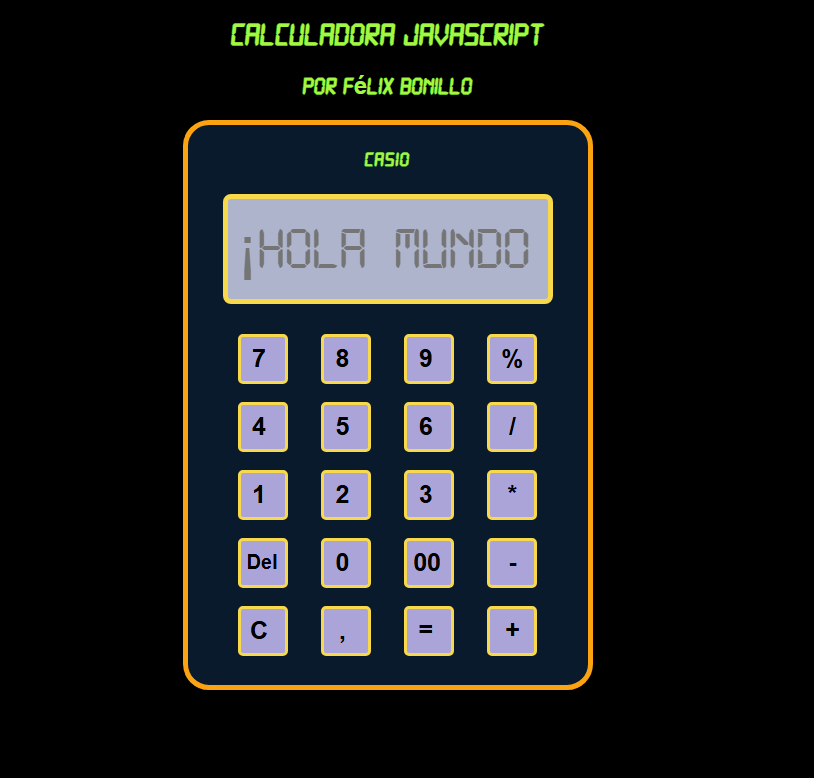

Hola bienvenido al repositorio :D

Actualmente me encuentro realizando un curso de ##Javascript con Sergie code y uno de sus proyectos era realizar una calculadora, esta fue mejorada en cuando a estilos y funcionalidad.

Utiliza FLEXBOX para organizar los diferentes elementos de la calculadora junto a NoWrap para que no se rompa la calculadora, esta funcionando, quizas le anada mas funciones en un futuro, espero te guste :D

## Funciones Principales

### `agregarALaPantalla(value)`

Esta función se encarga de agregar el valor proporcionado a la pantalla de la calculadora. Recibe un parámetro `value` que representa el valor que se debe agregar. Utiliza `document.getElementById('pantalla')` para obtener el elemento de la pantalla por su identificador y luego actualiza el valor del campo `value` concatenando el nuevo valor.

    function agregarALaPantalla(value) {
        document.getElementById('pantalla').value += value;
    }

### `calcular()`

La función `calcular()` se ejecuta cuando se presiona el botón de igual (=) en la calculadora. Primero, obtiene el valor actual de la pantalla utilizando `document.getElementById('pantalla').value`. Luego, utiliza la función `eval()` para evaluar la expresión matemática representada por el valor de la pantalla. El resultado se almacena en la variable `result`. Finalmente, se actualiza el valor de la pantalla con el resultado calculado.

    function calcular() {
        const valorPantalla = document.getElementById('pantalla').value;
        const result = eval(valorPantalla);
        document.getElementById('pantalla').value = result;
    }

Es importante tener en cuenta que el uso de `eval()` puede presentar riesgos de seguridad si se permite que los usuarios ingresen código arbitrario. En este caso, asumimos que el código solo se ejecutará en un entorno seguro.

### `limpiarPantalla()`

La función `limpiarPantalla()` se utiliza para borrar el contenido de la pantalla de la calculadora. Simplemente asigna una cadena vacía al campo `value` del elemento de la pantalla.

    function limpiarPantalla() {
        document.getElementById('pantalla').value = '';
    }

### `Del()`

La funcion `Del()` se utiliza para borrar el ultimo caracter pulsado en pantalla sin necesidad de borrar todo el contenido escrito. Simplemente evalua la cantidad de caracteres del string y le resta 1.

    function del() {
        let numero = document.getElementById("pantalla").value;
        let nuevoNumero = numero.substring(0, numero.length - 1);
        pantalla.value = nuevoNumero;
    }

-1.png>)

